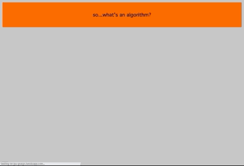

[Live Link](https://jpa-goalgo.herokuapp.com/)

## Features 
- [Features Overview](#Features-Overview)
- [Landing Page With Brief Explanation of Algorithms](#Landing-Page-With-Brief-Explanation-of-Algorithms)
- [Sorting Algorithms](#Sorting-Algorithms)
	- [Speed and Length Sliders](#Speed-and-Length-Sliders)
- [Pathfinding Algorithms](#Pathfinding-Algorithms)
	- [Draggable Graph Walls](#Draggable-Graph-Walls)


## Technologies 
The technologies used are simple and straightforward since this project lives on the front end, so I will simply list them here:
- React
- Vanilla CSS
- JavaScript

## Installation
1. Clone the repository
   ```bash
   $ git clone https://github.com/johnpatrickanders/goAlgo
   ```
2. Install dependencies
   ```bash
   $ npm install
   ```
3. Open in browser
   ```bash
   $ npm start
   ```


## Features Overview

goAlgo is a visualizer for sorting and pathfinding algorithms. Major features are highlighted below, and the app has potenitial for adding further sorting and pathfinding algorithms, further explanation breaking down each algorithm, and even visualizing data structures.

> Current Status: ongoing development

### Landing Page With Brief Explanation of Algorithms
***


The landing page displays a brief CSS animation that provides a very fundamental and accessible definition of what an algorithm is. This explanation is geared toward beginners. The animations are done using CSS keyframes.

### Sorting Algorithms
***
Once the introductory animation on the landing page completes, you may click on the logo to be taken to the sorting algorithms page. Bubble Sort, Quick Sort, Merge Sort, and Insertion Sort are currently available for animation. The animation consists of an array of HTML divs whose heights are dependent upon a randomly generated array of integers. Upon the user's click, the array is sorted with the selected algorithm, framed, and then reinterpreted for the DOM. Using AJAX calls allows the DOM to "animate" the split-second calculations just described at the interval the user provides.

 

### Speed and Length Sliders
***
The speed and size of the sort may be changed by two sliders. The speed slider is scaled and incremental: scaled in that as you approach a higher number range, the actual speed is manipulated to counter the exponential nature of the calculation; incremental in that there are simply five set points on the slider that are selectable. These five speeds have been identified as optimal for animation.

As for the length slider, this is straightforward in that it simply generates a larger or smaller array based on the speed slider's value. The only detailed piece here is ensuring the width of the sum of width of the bars did not overflow the page.

 


### Pathfinding Algorithms
***

Three pathfinding algorithms are included at this time: Breadth-First Search, Depth-First Search, and Dijkstra's Pathfinding Algorithm. For my implementation, pathfinding is performed on a blank graph data structure, where each square of the graph is a node (both in the abstract data structure sense and in the literal sense that each node is a Node react component). Each node has a variety of properties which the pathfinding algorithms will use for computation. Some properties, like isVisited, are booleans. Two properties that are not booleans are column and row, which allow us to keep track of where a given node is relative to the graph as a whole. Below you'll see the main component's code which represents the graph as a whole. Each Node component has classes applied accordingly as data changes. As usual, at the end of the day the nodes are really just HTML divs with classes dictating their appearance.

```js
return (
    <div className='grid'>
      {grid.map((row, rowIdx) => {
        return (
          <div key={rowIdx} className='grid-row'>
            {row.map((node) => {
              const { isStart, isFinish, isVisited, col, row, isWall } = node;
              return (
                <Node
                  isStart={isStart}
                  isFinish={isFinish}
                  key={col + '-' + row}
                  location={row + '-' + col}
                  isVisited={isVisited}
                  row={row}
                  col={col}
                  onMouseDown={handleMouseDown}
                  onMouseEnter={handleMouseEnter}
                  onMouseUp={handleMouseUp}
                  isWall={isWall}
                ></Node>
              );
            })}
          </div>
        )
      })}
    </div>
  )
```


### Draggable Graph Walls
***
The user may drop walls along the pathfinding graph by clicking an unoccupied node. This fills the node with a black circle and marks it as a wall. Later, when the user clicks the sort button, the given pathfinding algorithm is able to notice which nodes are marked in this way.


##User Stories
As a software engineering student, I want to be able visualize common sorting algorithms in order to understand them at a high level.

